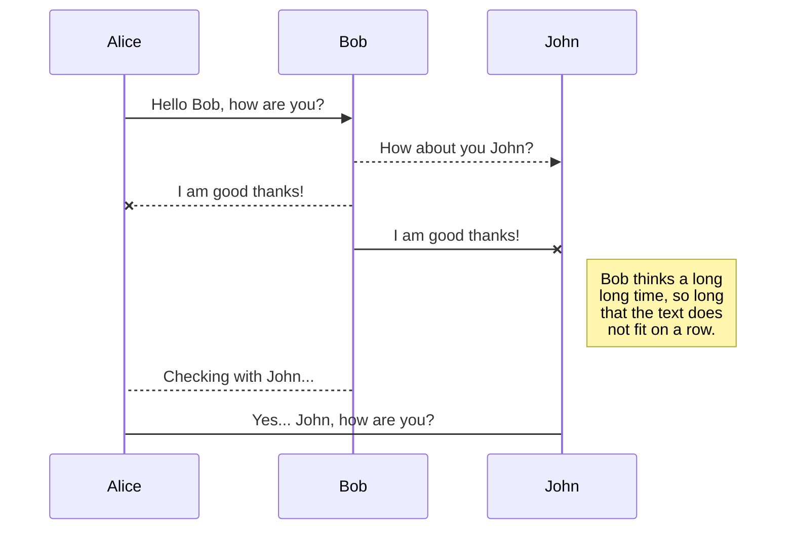
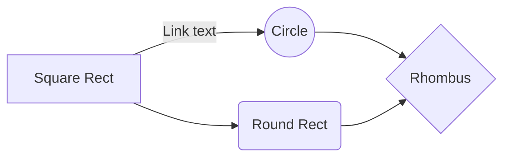

# HTP Diagnosis Aid App 

HTP: House, Tree, Person 

## Version Information

This app is Beta Version which includes only short description to help interpret client's drawings:  Please note that this psychoanalysis app is for reference only and may have different interpretations depending on the client's disposition or environment.
- App does not support to save client information.
- App does not generate diagnosis reports.
- Basic background knowledge of HTP is required to fully utilize this application. 
- Built-in tutorial does not explain the details about HTP

## Table of Contents
- [Configuration Instruction](#configuration-instructions)
    - [TER](#typo3-extension-repository)
    - [Composer](#composer)
- [How to Run](#how-to-run)
- [How to Use](#how-to-use)
- 
## Configuration Instructions
### System/Software Requirement 
 - App fully operates at Android device: Above version 10.0 is highly recommended.
 - It might work on iOS, but not guaranteed.
 - It is necessary to run at EXPO. 
 ### Intended users
 If users need to use this app for practical HTP diagnosis, it is highly recommended to go through the tutorial at the home screen. Otherwise user can simply navigate the contents of application for obtaining required information about HTP diagnosis.
 - Professionals: Psychoanalyst, Art therapist, 
 - Amateur: Counselor or student learning HTP
 - Third-party: general public with a strong interest in HTP test


## How to Run

This beta version has no extraction file for installation. You should import gitHub files at EXPO and run with QR code  

## How to Use

App is purely for navigating HTP diagnosis rules for 

## Feature List

-   Operating instructions
-   A manifest (list of files)
-   Copyright information
-   Contact information
-   Bug list
-   Troubleshooting tips
-   Credits and acknowledgments


-   Project badges

-   Concise project description
-   Clear install instructions
-   Features list
-   Links to further reading
-   Change log


# Files

StackEdit stores your files in your browser, which means all your files are automatically saved locally and are accessible **offline!**

## Create files and folders

The file explorer is accessible using the button in left corner of the navigation bar. You can create a new file by clicking the **New file** button in the file explorer. You can also create folders by clicking the **New folder** button.

## Switch to another file

All your files and folders are presented as a tree in the file explorer. You can switch from one to another by clicking a file in the tree.

## Rename a file

You can rename the current file by clicking the file name in the navigation bar or by clicking the **Rename** button in the file explorer.

## Delete a file

You can delete the current file by clicking the **Remove** button in the file explorer. The file will be moved into the **Trash** folder and automatically deleted after 7 days of inactivity.

## Export a file

You can export the current file by clicking **Export to disk** in the menu. You can choose to export the file as plain Markdown, as HTML using a Handlebars template or as a PDF.

|                |ASCII                          |HTML                         |
|----------------|-------------------------------|-----------------------------|
|Single backticks|`'Isn't this fun?'`            |'Isn't this fun?'            |
|Quotes          |`"Isn't this fun?"`            |"Isn't this fun?"            |
|Dashes          |`-- is en-dash, --- is em-dash`|-- is en-dash, --- is em-dash|


## KaTeX

You can render LaTeX mathematical expressions using [KaTeX](https://khan.github.io/KaTeX/):

The *Gamma function* satisfying $\Gamma(n) = (n-1)!\quad\forall n\in\mathbb N$ is via the Euler integral

$$
\Gamma(z) = \int_0^\infty t^{z-1}e^{-t}dt\,.
$$

> You can find more information about **LaTeX** mathematical expressions [here](http://meta.math.stackexchange.com/questions/5020/mathjax-basic-tutorial-and-quick-reference).


## UML diagrams

You can render UML diagrams using [Mermaid](https://mermaidjs.github.io/). For example, this will produce a sequence diagram:



And this will produce a flow chart:



<a href="https://aimeos.org/">
    
</a>

# Aimeos TYPO3 extension

[](https://packagist.org/packages/aimeos/aimeos-typo3)
[](https://scrutinizer-ci.com/g/aimeos/aimeos-typo3/?branch=master)
[](https://packagist.org/packages/aimeos/aimeos-typo3)

:star: Star us on GitHub — it motivates us a lot!

[Aimeos](https://aimeos.org/TYPO3) is THE professional, full-featured and
high performance e-commerce extension for TYPO3!  You can install it in your
existing TYPO3 web site within 5 minutes and can adapt, extend, overwrite
and customize anything to your needs.

[](http://typo3.demo.aimeos.org/)

## Table of content

- [Installation](#installation)
    - [TER](#typo3-extension-repository)
    - [Composer](#composer)
- [TYPO3 setup](#typo3-setup)
    - [Extension](#extension)
    - [Database](#database)
- [Page setup](#page-setup)
    - [Upload the page tree file](#upload-the-page-tree-file)
    - [Go to the import view](#go-to-the-import-view)
    - [Import the page tree](#import-the-page-tree)
    - [SEO-friendly URLs](#seo-friendly-urls)
- [License](#license)
- [Links](#links)

## Installation

This document is for the latest Aimeos TYPO3 **21.10 release and later**.

- LTS release: 21.10 (TYPO3 10/11 LTS)

### Composer

**Note:** composer 2.1+ is required!

The latest version can be installed via composer too. This is especially useful if you want to create new TYPO3 installations automatically or play with the latest code. You need to install the composer package first if it isn't already available:

`php -r "readfile('https://getcomposer.org/installer');" | php -- --filename=composer`

In order to tell install TYPO3, you have to execute

`composer create-project typo3/cms-base-distribution myshop`

This will install TYPO3 into the `./myshop/` directory.

Then, change to the `./mshop/` directory and install the Aimeos extension for TYPO3 with:

`composer req aimeos/aimeos-typo3:~21.10`

This will install stable TYPO3 version and the latest Aimeos TYPO3 extension. If you want a more or less working installation out of the box for new installations, you should install the Bootstrap package too:

`composer req bk2k/bootstrap-package`

### TER extension

If you want to install Aimeos into your existing TYPO3 installation, the [Aimeos extension from the TER](https://typo3.org/extensions/repository/view/aimeos) is recommended. You can download and install it directly from the Extension Manager of your TYPO3 instance.

For new TYPO3 installations, there's a 1-click [Aimeos distribution](https://typo3.org/extensions/repository/view/aimeos_dist) available too. Choose the Aimeos distribution from the list of available distributions in the Extension Manager and you will get a completely set up shop system including demo data for a quick start.

## TYPO3 setup

Setup TYPO3 as normal by creating a `FIRST_INSTALL` file in the `./public` directory:

```bash
touch public/FIRST_INSTALL
```

Open the URL of your installation in the browser and follow the steps in the TYPO3 setup scripts.

### Database setup

If you use MySQL < 5.7.8, you have to use `utf8` and `utf8_unicode_ci` instead because those MySQL versions can't handle the long indexes created by `utf8mb4` (up to four bytes per character) and you will get errors like

```
1071 Specified key was too long; max key length is 767 bytes
```

To avoid that, change your database settings in your `./typo3conf/LocalConfiguration.php` to:

```
'DB' => [
    'Connections' => [
        'Default' => [
            'tableoptions' => [
                'charset' => 'utf8',
                'collate' => 'utf8_unicode_ci',
            ],
            // ...
        ],
    ],
],
```

### Security

Since **TYPO3 9.5.14+** implements **SameSite cookie handling** and restricts when browsers send cookies to your site. This is a problem when customers are redirected from external payment provider domain. Then, there's no session available on the confirmation page. To circumvent that problem, you need to set the configuration option `cookieSameSite` to `none` in your `./typo3conf/LocalConfiguration.php`:

```
    'FE' => [
        'cookieSameSite' => 'none'
    ]
```

### Composer

#### TYPO3 11

When using TYPO3 11, you have to run these commands from your installation directory:

```bash
php ./vendor/bin/typo3 extension:setup
php ./vendor/bin/typo3 aimeos:setup --option=setup/default/demo:1
```

If you don't want to add the Aimeos demo data, you should remove `--option=setup/default/demo:1` from the Aimeos setup command.

#### TYPO3 10

For TYPO3 10, these commands are required:

```bash
php ./vendor/bin/typo3 extension:activate scheduler
php ./vendor/bin/typo3 extension:activate aimeos
```

### TER Extension

* Log into the TYPO3 back end
* Click on ''Admin Tools::Extension Manager'' in the left navigation
* Click the icon with the little plus sign left from the Aimeos list entry (looks like a lego brick)


Afterwards, you have to execute the update script of the extension to create the required database structure:


## Site setup

TYPO3 10+ requires a site configuration which you have to add in "Site Management" > "Sites" available in the left navigation.

## Page setup

The page setup for an Aimeos web shop is easy if you import the example page tree for TYPO3 10/11:

* [21.10+ page tree](https://aimeos.org/fileadmin/download/Aimeos-pages_21.10.t3d) only

**Note:** The Aimeos layout expects [Bootstrap](https://getbootstrap.com) providing the grid layout!

### Go to the import view

* In Web::Page, root page (the one with the globe)
* Right click on the globe
* Move the cursor to "Branch actions"
* In the sub-menu, click on "Import from .t3d"


### Upload the page tree file

* In the page import dialog
* Select the "Upload" tab (2nd one)
* Click on the "Select" dialog
* Choose the file you've downloaded
* Press the "Upload files" button


### Import the page tree

* In Import / Export view
* Select the uploaded file from the drop-down menu
* Click on the "Preview" button
* The pages that will be imported are shown below
* Click on the "Import" button that has appeared
* Confirm to import the pages


Now you have a new page "Shop" in your page tree including all required sub-pages.

### SEO-friendly URLs

TYPO3 9.5 and later can create SEO friendly URLs if you add the rules to the site config:
[https://aimeos.org/docs/latest/typo3/setup/#seo-urls](https://aimeos.org/docs/latest/typo3/setup/#seo-urls)

## License

The Aimeos TYPO3 extension is licensed under the terms of the GPL Open Source
license and is available for free.

## Links

* [Web site](https://aimeos.org/integrations/typo3-shop-extension/)
* [Documentation](https://aimeos.org/docs/TYPO3)
* [Forum](https://aimeos.org/help/typo3-extension-f16/)
* [Issue tracker](https://github.com/aimeos/aimeos-typo3/issues)
* [Source code](https://github.com/aimeos/aimeos-typo3)
